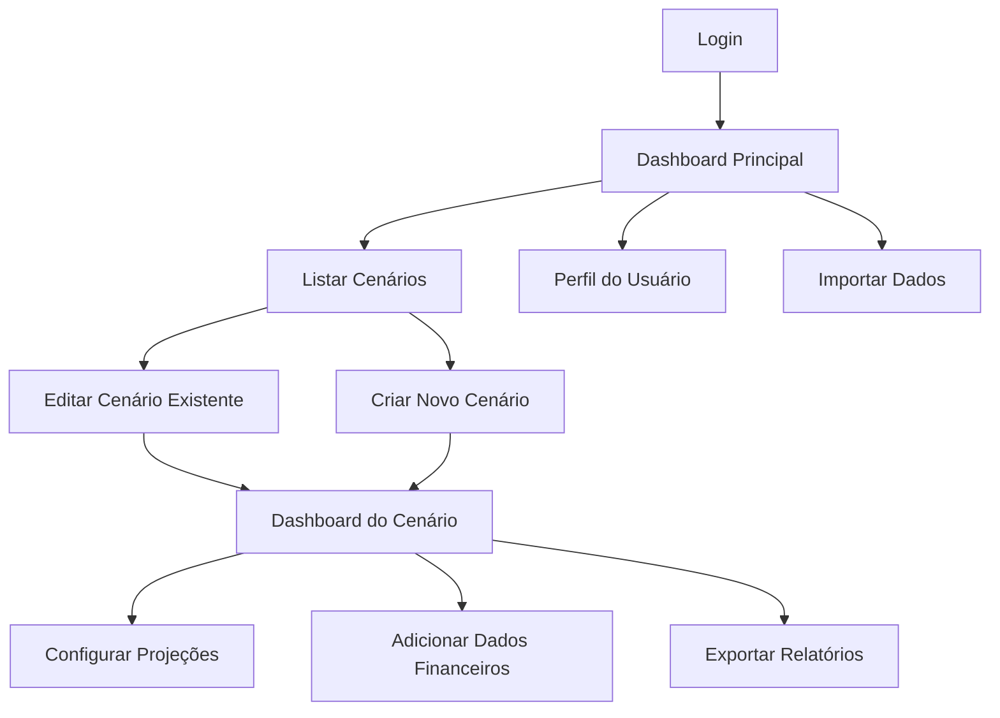
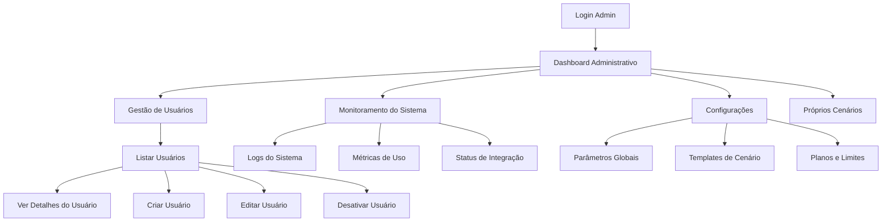

# Habitus Forecast


[](https://python.org)
[](https://fastapi.tiangolo.com/)
[](https://www.mongodb.com/)
[](https://reactjs.org/)

Habitus Forecast é uma solução SaaS financeira que permite a análise preditiva e planejamento estratégico para finanças pessoais e empresariais. A aplicação possibilita a criação de múltiplos cenários financeiros, visualização de dados e projeções precisas baseadas em dados históricos.

## Sumário
- [Visão Geral](#visão-geral)
- [Recursos](#recursos)
- [Instalação](#instalação)
  - [Pré-requisitos](#pré-requisitos)
  - [Instalação Local](#instalação-local)
  - [Usando Docker](#usando-docker)
- [Estrutura do Projeto](#estrutura-do-projeto)
- [Papéis de Usuário](#papéis-de-usuário)
  - [Usuário Regular](#usuário-regular)
  - [Administrador](#administrador)
- [Fluxos de Trabalho](#fluxos-de-trabalho)
- [Referência da API](#referência-da-api)
- [Contribuições](#contribuições)
- [Licença](#licença)

## Visão Geral

Habitus Forecast foi desenvolvido para simplificar o planejamento financeiro através de uma interface intuitiva e ferramentas analíticas avançadas. O sistema permite:

- Criação e gestão de múltiplos cenários financeiros
- Projeções baseadas em dados históricos e tendências
- Visualização interativa de dados financeiros
- Comparação entre diferentes cenários e estratégias
- Importação e exportação de dados
- Relatórios personalizados e dashboards

A aplicação foi desenvolvida com uma arquitetura moderna usando Python (FastAPI) no backend e React no frontend, com MongoDB como banco de dados.

## Recursos

- **Gestão de Cenários**: Crie, edite e compare diferentes cenários financeiros
- **Projeções Automatizadas**: Algoritmos avançados para projetar receitas e despesas futuras
- **Dashboards Interativos**: Visualizações personalizáveis para monitorar indicadores-chave
- **Suporte a Múltiplos Usuários**: Controle de acesso baseado em papéis
- **Importação e Exportação**: Suporte para Excel, CSV e integração com outras ferramentas
- **API Completa**: Integração facilitada com outros sistemas
- **Interface Responsiva**: Experiência otimizada em dispositivos móveis e desktop

## Instalação

### Pré-requisitos

- Python 3.11 ou superior
- MongoDB 5.0 ou superior
- Node.js 18.0 ou superior (para desenvolvimento frontend)
- Docker e Docker Compose (opcional, para implantação containerizada)

### Instalação Local

1. Clone o repositório:
   ```bash
   git clone https://github.com/seu-usuario/habitus-forecast.git
   cd habitus-forecast
   ```

2. Configure o ambiente Python:
   ```bash
   python -m venv venv
   source venv/bin/activate  # No Windows: venv\Scripts\activate
   pip install -r requirements.txt
   ```

3. Configure as variáveis de ambiente:
   ```bash
   cp .env.example .env
   # Edite o arquivo .env com suas configurações
   ```

4. Inicialize o banco de dados:
   ```bash
   python -m app.db.init_db
   ```

5. Execute o backend:
   ```bash
   uvicorn app.main:app --reload
   ```

6. Em outro terminal, instale e execute o frontend:
   ```bash
   cd client
   npm install
   npm start
   ```

7. Acesse a aplicação em http://localhost:3000

### Usando Docker

1. Clone o repositório:
   ```bash
   git clone https://github.com/seu-usuario/habitus-forecast.git
   cd habitus-forecast
   ```

2. Configure as variáveis de ambiente:
   ```bash
   cp .env.example .env
   # Edite o arquivo .env com suas configurações
   ```

3. Inicie os containers:
   ```bash
   docker-compose up -d
   ```

4. Acesse a aplicação em http://localhost:8080

Para ambientes de desenvolvimento, utilize:
```bash
docker-compose -f docker-compose.dev.yml up -d
```

## Estrutura do Projeto

```
habitus-forecast/
├── app/                     # Backend Python/FastAPI
│   ├── api/                 # Endpoints da API
│   │   ├── v1/              # API versão 1
│   │   │   ├── auth.py      # Endpoints de autenticação
│   │   │   ├── users.py     # Endpoints de usuários
│   │   │   ├── scenarios.py # Endpoints de cenários
│   │   │   └── ...
│   ├── core/                # Configurações e constantes
│   ├── db/                  # Interação com banco de dados
│   ├── models/              # Modelos de dados
│   ├── schemas/             # Schemas Pydantic
│   ├── services/            # Lógica de negócios
│   └── utils/               # Utilitários e helpers
├── client/                  # Frontend React
│   ├── public/              # Arquivos estáticos
│   ├── src/                 # Código-fonte React
│   │   ├── components/      # Componentes reutilizáveis
│   │   ├── hooks/           # React hooks customizados
│   │   ├── pages/           # Páginas da aplicação
│   │   ├── services/        # Serviços de API
│   │   └── utils/           # Utilitários frontend
├── docker/                  # Configurações Docker
├── scripts/                 # Scripts utilitários
├── tests/                   # Testes automatizados
│   ├── api/                 # Testes de API
│   ├── services/            # Testes de serviços
│   └── utils/               # Testes de utilitários
├── .env.example             # Exemplo de variáveis de ambiente
├── docker-compose.yml       # Configuração Docker Compose
├── requirements.txt         # Dependências Python
└── README.md                # Este arquivo
```

## Papéis de Usuário

O Habitus Forecast implementa um sistema de controle de acesso baseado em papéis (RBAC) para garantir que os usuários tenham acesso apenas às funcionalidades apropriadas.

### Usuário Regular

**Permissões:**
- Gerenciar seus próprios dados de perfil
- Criar, editar e excluir seus próprios cenários financeiros
- Visualizar dashboards e relatórios de seus dados
- Importar e exportar seus próprios dados
- Criar projeções baseadas em seus dados históricos

**Limitações:**
- Não pode acessar dados de outros usuários
- Não pode modificar configurações do sistema
- Número limitado de cenários simultâneos (conforme plano de assinatura)

### Administrador

**Permissões:**
- Todas as permissões de usuário regular
- Gerenciar usuários (criar, editar, desativar)
- Visualizar estatísticas de uso do sistema
- Configurar parâmetros do sistema
- Acessar logs e monitorar atividades
- Gerenciar planos de assinatura e cobranças
- Criar cenários-modelo que podem ser disponibilizados para todos os usuários

**Recursos adicionais:**
- Dashboard administrativo
- Relatórios de uso e análise de tendências
- Ferramentas de suporte ao cliente

## Fluxos de Trabalho

### Fluxo de Trabalho do Usuário Regular

1. **Cadastro e Login**
   - Criar conta com email e senha
   - Confirmação por email
   - Login no sistema

2. **Configuração Inicial**
   - Completar perfil
   - Configurar preferências
   - Importar dados financeiros iniciais (opcional)

3. **Criação de Cenários**
   - Criar um novo cenário
   - Definir parâmetros iniciais (período, nome, descrição)
   - Adicionar dados financeiros (receitas, despesas, investimentos)
   - Configurar premissas para projeções

4. **Análise e Projeções**
   - Visualizar dashboard do cenário
   - Aplicar diferentes algoritmos de projeção
   - Ajustar parâmetros e simular resultados
   - Comparar com outros cenários

5. **Compartilhamento e Exportação**
   - Exportar relatórios em diferentes formatos
   - Salvar visualizações e dashboards
   - Compartilhar análises (se disponível no plano)



### Fluxo de Trabalho do Administrador

1. **Gestão de Usuários**
   - Visualizar lista de usuários
   - Criar novos usuários
   - Editar perfis e permissões
   - Desativar/reativar contas

2. **Monitoramento do Sistema**
   - Visualizar dashboard administrativo
   - Analisar métricas de uso
   - Verificar logs de atividade
   - Monitorar desempenho

3. **Configuração do Sistema**
   - Ajustar parâmetros globais
   - Configurar integrações
   - Gerenciar templates e modelos
   - Atualizar planos e limites



## Referência da API

A API do Habitus Forecast segue princípios RESTful e utiliza JSON para comunicação. A documentação completa da API está disponível em `/api/docs` ou `/api/redoc` quando o servidor está em execução.

Principais endpoints:

| Endpoint | Método | Descrição | Papel Necessário |
|----------|--------|-----------|------------------|
| `/api/v1/auth/login` | POST | Autenticação de usuário | Público |
| `/api/v1/auth/refresh` | POST | Renovar token de acesso | Usuário |
| `/api/v1/users/me` | GET | Obter perfil do usuário atual | Usuário |
| `/api/v1/users` | GET | Listar todos os usuários | Admin |
| `/api/v1/users/{user_id}` | GET | Obter usuário específico | Admin |
| `/api/v1/scenarios` | GET | Listar cenários do usuário | Usuário |
| `/api/v1/scenarios` | POST | Criar novo cenário | Usuário |
| `/api/v1/scenarios/{scenario_id}` | GET | Obter cenário específico | Proprietário/Admin |
| `/api/v1/scenarios/{scenario_id}/projections` | POST | Gerar projeções | Proprietário/Admin |
| `/api/v1/admin/metrics` | GET | Obter métricas do sistema | Admin |

Para mais detalhes, consulte a [Documentação da API](api-docs.md).

## Contribuições

Veja [CONTRIBUTING.md](CONTRIBUTING.md) para detalhes sobre como contribuir com o projeto.

## Licença

Este projeto está licenciado sob a licença MIT - veja o arquivo [LICENSE](LICENSE) para detalhes.

## Script de Instalação Automatizada

O projeto inclui um script de instalação automatizada que facilita a configuração do Habitus Forecast em um servidor Ubuntu.

### Como usar o script de instalação

1. Certifique-se de que você tenha acesso de superusuário (root) ao servidor Ubuntu.

2. Faça download do projeto ou clone o repositório para o servidor:
   ```bash
   git clone https://github.com/seu-usuario/habitus-forecast.git
   cd habitus-forecast
   ```

3. Torne o script executável (se ainda não estiver):
   ```bash
   chmod +x install.sh
   ```

4. Execute o script de instalação com permissões de superusuário:
   ```bash
   sudo ./install.sh
   ```

5. Siga as instruções na tela. O script solicitará as seguintes informações:
   - Domínio para a aplicação (ex: exemplo.com)
   - Diretório de instalação (padrão: /opt/habitus-forecast)
   - Nome de usuário para MongoDB (padrão: admin)
   - Senha para o MongoDB (será gerada aleatoriamente se não for fornecida)
   - Chave secreta para JWT (será gerada aleatoriamente se não for fornecida)
   - Fuso horário (padrão: America/Sao_Paulo)
   - Se deseja configurar SSL com Let's Encrypt (s/n)

6. Após confirmar as informações, o script irá:
   - Atualizar o sistema
   - Instalar Docker e Docker Compose
   - Configurar o firewall
   - Configurar o ambiente
   - Configurar SSL (Let's Encrypt ou autoassinado)
   - Construir e iniciar os containers

7. Ao final da instalação, o script exibirá um resumo com as informações importantes e comandos úteis.

### Requisitos

- Ubuntu 20.04 LTS ou 22.04 LTS
- Mínimo de 2GB de RAM
- Mínimo de 30GB de espaço em disco
- Um domínio apontando para o IP do servidor (necessário para SSL com Let's Encrypt)

### Observações

- O script deve ser executado como superusuário (sudo)
- Para ambientes de produção, recomenda-se usar certificados SSL do Let's Encrypt
- Todas as credenciais geradas serão exibidas ao final da instalação. Certifique-se de guardá-las em um local seguro.

Para mais informações, consulte o guia de instalação completo em `docs/installation_guide.md`.